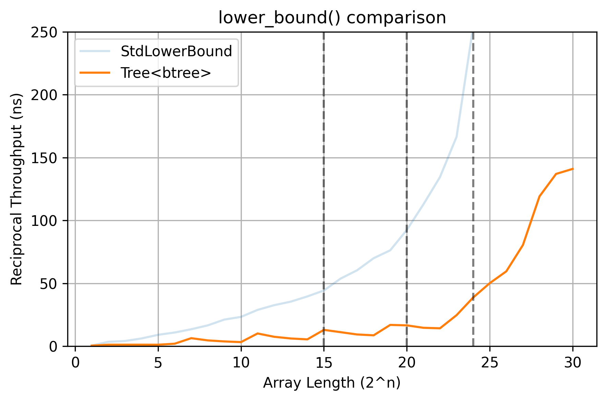

# btree

Fast static B-trees compared against `std::lower_bound`.

  - [btree_eytzinger](#btree_eytzinger)
  
## Implementations



### btree_eytzinger

This is the first of our trees. It extends the Eytzinger layout (`2k`, `2k + 1`) to B-trees which have `B + 1` children, where `B` is the number of keys in a block (16 in this case - one cache line). This outperforms `std::lower_bound` by up to 10x in terms of reciprocal throughput.

```
         33,342.07 msec task-clock                       #    1.000 CPUs utilized
               119      context-switches                 #    3.569 /sec
                31      cpu-migrations                   #    0.930 /sec
           393,341      page-faults                      #   11.797 K/sec
   154,544,839,443      cycles                           #    4.635 GHz
    12,548,845,590      stalled-cycles-frontend          #    8.12% frontend cycles idle
    69,975,970,406      instructions                     #    0.45  insn per cycle
                                                  #    0.18  stalled cycles per insn
    10,919,555,364      branches                         #  327.501 M/sec
     1,139,807,265      branch-misses                    #   10.44% of all branches
```

`perf` shows there is a very high percentage of branch mispredicts and more frontend stalls than we'd like. It also shows exactly where we're spending our time:

```
       │    │found = _tree[block * constants::block_len + i];                                                                                                                 
  2.10 │330:│  movzx        eax,ax                                                                                                                                            
       │    │return child_block + offset;                                                                                                                                     
  6.69 │    │  lea          edx,[rdx+rcx*1+0x1]                                                                                                                               
       │    │found = _tree[block * constants::block_len + i];                                                                                                                 
  3.13 │    │  lea          edi,[rax+rcx*1]                                                                                                                                   
       │    │return child_block + offset;                                                                                                                                     
  4.79 │    │  add          edx,eax                                                                                                                                           
       │    │found = _tree[block * constants::block_len + i];                                                                                                                 
  3.83 │    │  mov          edi,DWORD PTR [r11+rdi*4]                                                                                                                         
       │    │while (block < _nblocks) {                                                                                                                                       
  4.19 │    │  cmp          esi,edx                                                                                                                                           
       │    │↑ ja           278                                                                                                                                               
 30.96 │    └──jmp          2ad     
```

It seems like we're struggling to predict the `while` condition while traversing the B-tree, which makes sense. If we knew the height in advance, we could completely remove branches and have the compiler unroll a fixed size loop.
